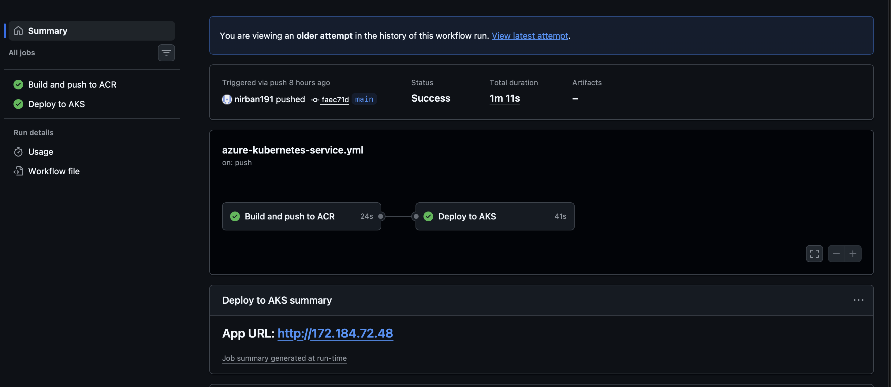
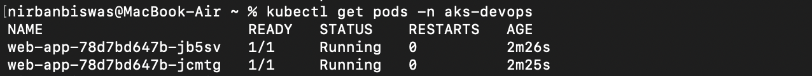
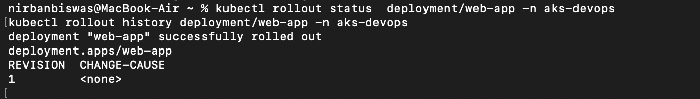
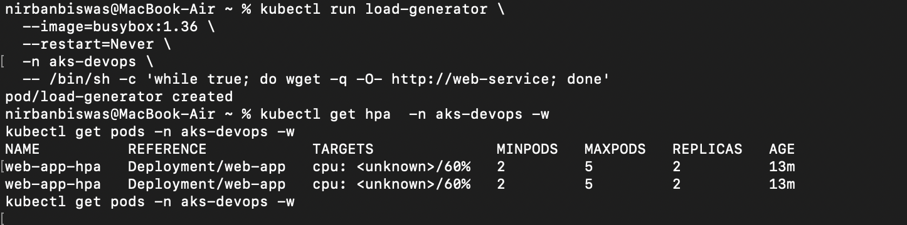
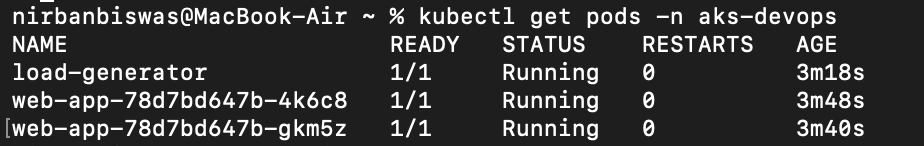

# AKS DevOps Project

A small NGINX workload on Azure Kubernetes Service, built and deployed by GitHub Actions.
The image lives in a private Azure Container Registry; the pipeline authenticates to Azure
with OIDC federation, so no credentials are stored in GitHub.

```
git push (main)
   │
   ▼
GitHub Actions ──OIDC──► Azure
   │  build job:  docker buildx (linux/arm64) ──push──► ACR
   │  deploy job: aks-set-context ──kubectl apply──► AKS
   ▼
AKS namespace: aks-devops
   Deployment web-app  ─ image pulled from ACR by the kubelet identity
   ConfigMap web-content ─ mounted over index.html
   Service web-service ─ type LoadBalancer ─► public IP
   HPA web-app-hpa ─ 2–5 replicas, 60% CPU target
```

## Demonstration

**End-to-end pipeline run**



A push to `main` builds the arm64 image, pushes it to ACR tagged with the commit SHA, and
deploys to AKS — both jobs green in about a minute. The deploy job reads the
LoadBalancer's external IP from the Service and writes it to the run summary, so the live
URL appears with every successful deployment.

**Deployment — two healthy replicas**



Both `web-app` pods reach `1/1 Running` with zero restarts, which means the readiness and
liveness probes are passing against the NGINX root path.

**Rollout status and revision history**



`kubectl rollout status` confirms the deployment converged; `rollout history` shows the
revision that Kubernetes will roll back to. `CHANGE-CAUSE` is empty because the revision was
created by `kubectl apply` without an annotation — setting
`kubernetes.io/change-cause` before a change populates this column.

**Horizontal Pod Autoscaler under load**



The HPA is registered against the Deployment with a 60% CPU target and bounds of 2–5
replicas. `TARGETS` reads `<unknown>` in this capture because metrics-server had not yet
completed its first collection window; it resolves to a real percentage within about a
minute and the autoscaler then evaluates normally.

**Load generator driving traffic in-cluster**



A BusyBox pod requests `http://web-service` in a loop, exercising the ClusterIP Service and
generating CPU load on the NGINX pods. Resolving the Service by name from inside the
namespace also confirms cluster DNS is working.

## Repository layout

```
.
├── 00-namespace.yml          namespace aks-devops
├── 01-configmap.yml          web-content, holds index.html
├── 02-deployment.yml         web-app, image is a ${IMAGE} placeholder
├── 03-service.yml            web-service, type LoadBalancer
├── 04-hpa.yml                web-app-hpa, 2–5 replicas at 60% CPU
├── app/
│   ├── Dockerfile            nginx:1.27-alpine + index.html
│   └── index.html            baked-in default content
└── .github/workflows/
    └── azure-kubernetes-service.yml
```

Manifests are numbered because `kubectl apply -f .` processes files in filename order and
the namespace has to exist before anything that declares `namespace: aks-devops`.

## How the pipeline works

**build** — tags the image with the 7-character commit SHA, logs in to ACR, and builds for
`linux/arm64` using QEMU + Buildx. Pushes `<acr>.azurecr.io/web-app:<sha>`.

**deploy** — pulls a kubeconfig via `azure/aks-set-context`, substitutes the image
reference into the Deployment with `envsubst`, applies all five manifests, waits on
`kubectl rollout status`, and publishes the LoadBalancer IP to the run summary.

Because `02-deployment.yml` carries a `${IMAGE}` placeholder, it is not applied by hand —
the pipeline is the only supported path to the cluster.

## Infrastructure

Created once, outside the pipeline:

```bash
az group create -n <rg> -l westus

az acr create -g <rg> -n <acr-name> --sku Basic

az aks create -g <rg> -n <cluster> \
  --tier free --node-count 1 --node-vm-size Standard_D2ps_v6 \
  --enable-managed-identity --generate-ssh-keys

az aks update -g <rg> -n <cluster> --attach-acr <acr-name>
```

`--attach-acr` grants the cluster's kubelet identity **AcrPull** on the registry, which is
why no `imagePullSecret` appears anywhere in the manifests.

## Pipeline authentication

An Entra app registration with a federated credential — no client secret exists.

| Identity | Role | Scope |
|---|---|---|
| App registration (GitHub Actions) | `AcrPush` | the registry |
| App registration (GitHub Actions) | `Azure Kubernetes Service Cluster User Role` | the cluster |
| Cluster kubelet identity | `AcrPull` | the registry |

The federated credential's subject pins the trust to one repository and one branch:

```
repo:<owner>@<owner-id>/<repo>@<repo-id>:ref:refs/heads/main
```

GitHub moved to this immutable subject format (owner and repository IDs rather than names)
for repositories created after 15 July 2026. Older guides show `repo:<owner>/<repo>:ref:...`,
which will not match on a new repository.

Required GitHub repository secrets: `AZURE_CLIENT_ID`, `AZURE_TENANT_ID`,
`AZURE_SUBSCRIPTION_ID`. All three are identifiers, not credentials — the OIDC token
exchange is what actually grants access.

## Operating it

```bash
# rollout
kubectl rollout status  deployment/web-app -n aks-devops
kubectl rollout history deployment/web-app -n aks-devops

# rollback
kubectl rollout undo deployment/web-app -n aks-devops
kubectl rollout undo deployment/web-app -n aks-devops --to-revision=2

# troubleshooting
kubectl get all -n aks-devops
kubectl describe pod <pod> -n aks-devops
kubectl logs <pod> -n aks-devops
kubectl get events -n aks-devops --sort-by=.lastTimestamp

# autoscaler test
kubectl run load-generator --image=busybox:1.36 --restart=Never -n aks-devops \
  -- /bin/sh -c 'while true; do wget -q -O- http://web-service; done'
kubectl get hpa -n aks-devops -w
kubectl delete pod load-generator -n aks-devops
```

Note that `kubectl set image` changes only the cluster; the next pipeline run re-applies the
manifest and reverts it. Changes that should persist go through git.

## Cleanup

```bash
kubectl delete namespace aks-devops     # releases the LoadBalancer public IP first
az aks stop -g <rg> -n <cluster>        # pause node billing, keep the cluster
az group delete --name <rg> --yes       # remove everything
```

Container Insights, if enabled, creates its Log Analytics workspace in a separate
`DefaultResourceGroup-*` resource group, which must be deleted on its own.

## Design decisions

| Decision | Reason |
|---|---|
| No `replicas` in the Deployment | With an HPA present, a replica count in the manifest resets the scale on every apply and fights the autoscaler |
| Image tagged with the commit SHA | Every running pod maps to exactly one commit; no two deploys share a tag |
| OIDC federation, no client secret | Nothing to rotate or leak; trust is scoped to one repo and branch |
| `AcrPush` and Cluster User at resource scope | Least privilege — the pipeline identity cannot reach anything else in the subscription |
| `maxUnavailable: 0`, `maxSurge: 1` | Zero-downtime rolling updates with only two replicas |
| `targetPort: http` (named port) | Stays correct if the container port ever changes |
| Base image pinned to `nginx:1.27-alpine` | `:latest` would make the build unreproducible |
| Build targets `linux/arm64` | The node pool runs Ampere ARM VMs; an amd64 image crash-loops with `exec format error` |

## Known behaviours

- **The ConfigMap overrides the image content.** `index.html` is mounted over the path the
  Dockerfile writes to, so the browser shows the ConfigMap's HTML. The baked-in copy is a
  fallback and a build check.
- **ConfigMap edits alone do not reach running pods.** A `subPath` mount is resolved at pod
  start and never refreshed. Since the image tag changes each commit the pods restart anyway;
  for a ConfigMap-only change, run `kubectl rollout restart deployment/web-app -n aks-devops`.
- **The HPA reports `<unknown>`** until metrics-server's first collection window, roughly a
  minute after deployment.
- **Scaling is capped by node capacity.** On a single 2-vCPU node the HPA will scale but the
  scheduler may leave pods `Pending` with `Insufficient cpu`. The autoscaler is working; the
  cluster is the constraint.
- **The container runs as root**, inherited from the base image, because NGINX binds port 80.
  Production would use `nginxinc/nginx-unprivileged` on 8080 with matching `containerPort`
  and `targetPort`.

## Not included

Single-node cluster, one stateless workload, no TLS, no Ingress, no network policies, no
staged environments. A production version would add multiple node pools, an Ingress
controller with certificates, PodDisruptionBudgets, image scanning in the pipeline, and a
private API server endpoint.
